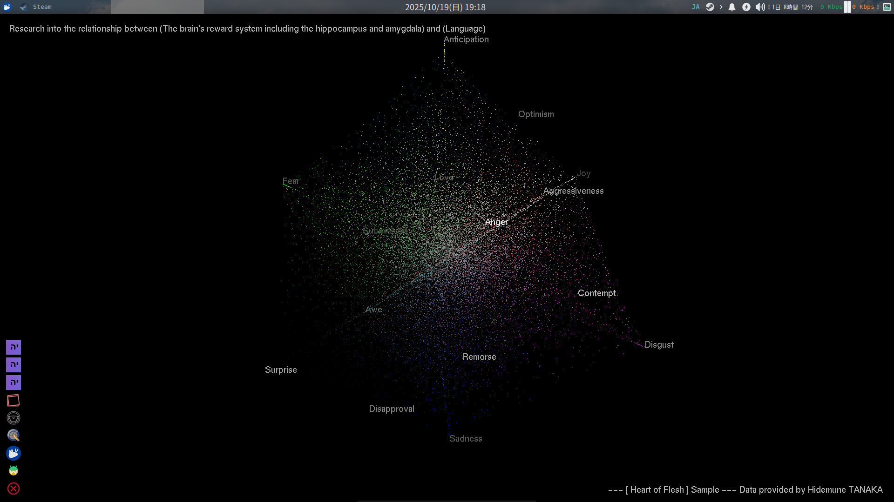

━━━━━━━━━━━━━━━━━━━━━━━

**About a cool new screensaver**

━━━━━━━━━━━━━━━━━━━━━━



*図１：* 私は Linux 上で、「動く壁紙」として使っています。が、基本的にスクリーンセーバーです。


[Creator]
Me

[How to Make]
I asked ChatGPT for a rough guide, and when I ran into a bug, I used Gemini to solve it.

[Tip]
After converting it to an exe on Windows, you can apparently use it as a screensaver on Windows 11 by changing the extension to ".scr" and placing it somewhere.

[Specific Steps]
The instructions for Ubuntu are as written in "emotionSaver.sh."

```
### Run it first in the folder
# python3 -m venv venv

### Preparing Python
# sudo apt install pip
# pip install pygame PyOpenGL numpy
# pip install PyOpenGL_accelerate
# pip install python-xlib
# sudo apt install freeglut3-dev
```

```
### To add to xscreensaver on Linux
#
# nano ~/.xscreensaver
# ...
# Add the following to the end:
#
# - GL: "EmotionSaver" /home/user/bin/emotion.sh --root \n\
#
```

```
### On Windows, change the extension to .src after changing the .exe filename Change it to
#
# pip install pyinstaller
#
# pyinstaller --noconsole --onefile yourscript.py
#
# The output will be dist/yourscript.exe
#
# mv yourscript.exe yourscript.scr
#
# Place it in C:\Windows or C:\Windows\System32
#
# It will then appear in the Windows screen saver settings screen.
# Administrator privileges may be required
```

[Other]
Try it and let us know what you think!
